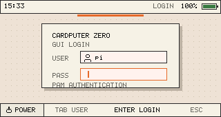

# cardputer-zero-os

`cardputer-zero-os` is the Cardputer Zero system profile for Raspberry Pi OS /
Debian.

It is not the desktop, launcher, app store, settings UI, file browser, terminal,
or app UI. It owns the internal-screen login and session plumbing that lets the
real post-login shell run as a normal authenticated Linux user.

## Boundary

```text
Raspberry Pi OS / Debian base
  -> Raspberry Pi Imager creates normal Linux users
  -> cardputer-zero-os owns internal-screen login/session/display policy
  -> cardputer-zero-shell owns the post-login launcher/task UI
  -> applications own their own windows and domain UI
```

`cardputer-zero-os` does not create a fixed `zero` user, does not store
passwords, does not enable autologin, and does not replace the normal HDMI Pi OS
desktop path.

## Current UI



The greeter is the pre-login system entry for the internal screen. It is not the
post-login shell.

## Internal-Screen Architecture

The internal screen uses one graphics path:

```text
internal ST7789 display
  -> panel-mipi-dbi-spi
  -> DRM/KMS connector
  -> labwc compositor
  -> Wayland greeter or Wayland/Xwayland user apps
```

The profile intentionally puts login, session, windows, and privilege prompts
back on standard Linux mechanisms:

- systemd starts the internal greeter as a real logind greeter session.
- PAM authenticates existing Linux users through a restricted root helper.
- logind owns greeter and user session activation.
- labwc owns the internal screen compositor sessions.
- ZeroShell runs as a Wayland client after login.
- Apps create Wayland or Xwayland windows.
- polkit handles privileged authorization prompts.

There is no alternate internal display backend in this repository. If the
standard path fails, it must fail visibly and be fixed through SSH, HDMI, or
service logs.

## Boot And Login Timing

```text
systemd boot
  -> zero-hdmi-lightdm-policy.service keeps HDMI LightDM separate
  -> zero-greetd.service opens a _greetd logind greeter session
  -> cardputer-zero-greeter-session starts labwc on /dev/dri/cardputer-zero-internal
  -> zero-greeter-wayland shows the 320x170 login UI
  -> user selects an existing Linux account and enters a password
  -> zero-greeter-wayland calls zero-greeter-auth
  -> zero-greeter-auth performs PAM authentication as root
  -> zero-greeter-auth starts cardputer-zero-session as that user
  -> cardputer-zero-session starts cardputer-zero-labwc-session
  -> labwc starts cardputer-zero-shell-session
  -> cardputer-zero-shell-session starts zero-window-agent
  -> cardputer-zero-shell-session execs /opt/cardputer-zero-shell/bin/zero-shell-wayland
```

Expected process shape:

```text
_greetd  labwc -C /etc/xdg/cardputer-zero-greeter-labwc
_greetd  /usr/local/bin/zero-greeter-wayland
pi       labwc -C /etc/xdg/cardputer-zero-labwc -S /usr/local/bin/cardputer-zero-shell-session
pi       python3 /usr/local/bin/cardputer-zero-idle
pi       zero-window-agent
pi       /opt/cardputer-zero-shell/bin/zero-shell-wayland
root     python3 /usr/local/bin/zero-key-policy
```

Not acceptable:

```text
root     /opt/cardputer-zero-shell/bin/zero-shell-wayland
root     user applications
```

## Linux Mechanisms Used

### Raspberry Pi Imager And Users

Users are owned by the base OS. Raspberry Pi Imager or normal Linux tools create
the account, password, WiFi, SSH settings, and groups.

The greeter discovers ordinary users from `/etc/passwd`:

- normal user UID range,
- home directory under `/home`,
- shell is not `nologin` or `false`.

### Greeter, PAM, And logind

The greeter UI is a small Wayland client running as `_greetd`. It does not read
`/etc/shadow`, does not run the user desktop, and does not keep a password
database. Its job is to draw the login form and collect the password on the
internal screen.

The actual authentication boundary is `/usr/local/libexec/cardputer-zero/zero-greeter-auth`.
It is installed as `root:_greetd` with mode `4750`. Only the greeter user can
execute it, and it accepts only a username/password request over stdin. It
performs PAM authentication using `cardputer-zero-login`, checks that the user
is an existing normal Linux user, and starts the fixed Cardputer Zero session
with `systemd-run` and `PAMName=cardputer-zero-session`.

```text
zero-greeter-wayland
  -> zero-greeter-auth
  -> PAM service cardputer-zero-login
  -> systemd-run User=<authenticated user> PAMName=cardputer-zero-session
  -> logind user session on seat-cardputer-zero
  -> cardputer-zero-session as the authenticated user
```

This mirrors a standard display-manager privilege split: the visible greeter is
not root, but the authentication/session broker has controlled root privilege.

### Internal DRM Display Overlay

The base `cardputerzero-overlay.dtbo` remains responsible for non-display
hardware such as keyboard, audio, M5 IO expander, sensors, and backlight.

The added display overlay is:

```text
/boot/firmware/overlays/cardputerzero-kms-display.dtbo
```

It disables the original `st7789v@0` display node and adds a
`panel-mipi-dbi-spi` `display@0` node on SPI0 CE0.

The panel firmware is:

```text
/lib/firmware/cardputerzero,st7789v.bin
```

It contains the ST7789 command stream used by Linux `panel-mipi-dbi`. The user
view is 320x170 in landscape orientation with `MADCTL = MV | MY = 0xa0` and the
35-pixel glass offset.

The generic panel module is loaded explicitly through:

```text
/etc/modules-load.d/cardputer-zero-kms.conf
```

### HDMI Separation

HDMI remains a normal Pi OS / LightDM / recovery surface. The Zero greeter is
only for the internal screen.

Stable DRM symlinks:

```text
/dev/dri/cardputer-zero-internal
/dev/dri/cardputer-zero-hdmi
```

The internal sessions set:

```text
WLR_DRM_DEVICES=/dev/dri/cardputer-zero-internal
WLR_BACKENDS=drm,libinput
WLR_RENDERER=pixman
XDG_SEAT=seat-cardputer-zero
```

The HDMI LightDM policy constrains Pi OS greeter/desktop work to the HDMI DRM
device when HDMI is present. HDMI remains on the normal `seat0`.

This seat split is required for simultaneous display. In logind, multiple
sessions may be attached to one seat, but only one can be active. If the Zero
internal session and HDMI LightDM both live on `seat0`, the inactive compositor
can fall back to a headless wlroots output such as `NOOP-1`. The internal
ST7789 DRM device and Cardputer keyboard are therefore assigned by udev to
`seat-cardputer-zero`, while HDMI stays on `seat0`.

### labwc Window Ownership

labwc is the compositor/window manager for the internal screen. Task identity is
a compositor window, not a process id. That is why launchable apps must be
Wayland or Xwayland clients.

### Internal Screen Idle Policy

The internal Zero session uses the standard wlroots tools `swayidle` and
`wlopm` for screen blanking. `cardputer-zero-idle` is only session glue: it
reads the user's display-power preference, starts `swayidle`, and lets `wlopm`
turn the internal Wayland output off and back on.

The canonical user preference file is:

```text
~/.config/cardputer-zero/session/display-power.json
```

with:

```json
{
  "screen_timeout": "2min"
}
```

Supported values are `30s`, `1min`, `2min`, `5min`, and `never`. Keyboard input
is handled through labwc/libinput and wakes the output through `swayidle`'s
`resume` hook.

### Global Tab/Esc Policy

When a foreground app has keyboard focus, ZeroShell cannot receive global key
events. `cardputer-zero-os` therefore owns the device-level key policy.

`zero-key-policy.service` runs as root because it listens to the internal
keyboard device before and after login and may need to activate the visible Zero
session through logind. It searches for the Zero user session on
`seat-cardputer-zero`. That is a Linux seat/session operation, not a launcher
operation. When it needs to tell ZeroShell what to do, it drops back to the
authenticated user and calls `zero-shell-control` inside that user's Wayland
runtime.

```text
Tab
  -> zero-shell-control tasks
  -> ZeroShell toggles running tasks

short Esc
  -> zero-shell-control minimize-active
  -> ZeroShell is focused fullscreen and the foreground app remains a task

long Esc
  -> zero-shell-control close-active
  -> labwc asks active window to close and focuses ZeroShell
```

If the active Zero session slips away, `zero-key-policy` reactivates it through
`loginctl activate <session>`. It does not expose a general VT switcher or
arbitrary root command path.

### polkit

Privileged operations go through polkit:

```text
user app or shell
  -> pkexec /usr/local/sbin/zero-helper <allowed action>
  -> polkit checks org.cardputerzero.zero-helper.*
  -> zero-polkit-agent opens the Zero-sized Wayland password prompt if needed
```

`zero-helper` is restricted. It does not provide arbitrary shell, arbitrary
`systemctl`, arbitrary package-manager, or arbitrary process-kill access.

## File Map

| File | Role |
| --- | --- |
| `install.sh` | Installs the OS profile, builds greeter/polkit tools, installs internal DRM display setup, enables Zero services. |
| `uninstall.sh` | Removes installed profile files while leaving Linux users intact. |
| `files/etc/systemd/system/zero-greetd.service` | Internal-screen greeter backend. The name is historical; it no longer runs greetd. |
| `files/etc/systemd/system/zero-key-policy.service` | Root-owned internal keyboard and seat activation policy service. |
| `files/etc/systemd/system/zero-hdmi-lightdm-policy.service` | Keeps HDMI LightDM independent from the internal screen. |
| `files/usr/local/bin/cardputer-zero-greeter-session` | Starts a small labwc greeter session and runs `zero-greeter-wayland`. |
| `files/usr/local/bin/cardputer-zero-idle` | Session helper that wires user screen-timeout preferences to `swayidle` and `wlopm`. |
| `greeter/zero-greeter-wayland.cpp` | 320x170 Wayland greeter UI. |
| `greeter/zero-greeter-auth.cpp` | Restricted root helper for PAM authentication and user session launch. |
| `files/etc/pam.d/cardputer-zero-greeter` | PAM stack that opens the `_greetd` greeter logind session. |
| `files/etc/pam.d/cardputer-zero-login` | Authentication-only PAM stack for checking the selected user's password. |
| `files/etc/pam.d/cardputer-zero-session` | PAM stack used when opening the authenticated Zero user session. |
| `files/usr/local/bin/cardputer-zero-session` | Post-auth session handoff script. |
| `files/usr/local/bin/cardputer-zero-labwc-session` | Starts user labwc on the internal DRM output and then starts ZeroShell. |
| `files/usr/local/bin/cardputer-zero-shell-session` | Starts `zero-window-agent`, requires its socket, then execs ZeroShell. |
| `window-agent/zero-window-agent.cpp` | Session-local bridge from labwc foreign-toplevel events to the Zero task socket. |
| `scripts/setup-window-agent.sh` | Builds and installs `zero-window-agent` from the vendored Wayland protocol. |
| `protocols/wlr-foreign-toplevel-management-unstable-v1.xml` | Vendored wlroots foreign-toplevel protocol used by `zero-window-agent`. |
| `files/etc/cardputer-zero/session.conf` | Paths and session policy for the internal Wayland session. |
| `files/etc/xdg/cardputer-zero-greeter-labwc/*` | labwc config for the pre-login greeter session. |
| `files/etc/xdg/cardputer-zero-labwc/*` | labwc config and user-session autostart. |
| `files/usr/local/bin/zero-shell-control` | Command bridge used by labwc and key policy to control tasks. |
| `files/usr/local/bin/zero-key-policy` | Narrow Cardputer keyboard policy for short/long Esc and Zero seat reactivation. |
| `files/usr/local/sbin/zero-helper` | Restricted privileged helper. |
| `polkit-agent/zero-polkit-agent.c` | Wayland-only polkit authentication agent. |
| `polkit-agent/zero-polkit-prompt-wayland.cpp` | Zero-sized Wayland password prompt. |
| `files/etc/udev/rules.d/99-cardputer-zero.rules` | Device groups, permissions, and DRM symlinks. |
| `scripts/setup-internal-drm-display.sh` | Installs the internal DRM display overlay and panel firmware. |
| `scripts/build-st7789v-panel-firmware.sh` | Generates the ST7789 `panel-mipi-dbi` firmware file. |
| `scripts/probe-graphics-stack.sh` | Prints DRM, SPI, overlay, module, and labwc facts. |
| `scripts/probe-labwc-session.sh` | Inspects labwc/logind/session state. |
| `scripts/test-labwc-internal-session.sh` | One-shot internal labwc smoke test. |

## Install

```sh
sudo apt-get install \
  build-essential pkg-config labwc wayland-protocols libpam0g-dev \
  device-tree-compiler libglib2.0-dev libpolkit-agent-1-dev \
  libpolkit-gobject-1-dev libwayland-dev libxkbcommon-dev

sudo ./install.sh
sudo reboot
```

The installer writes a backup of boot display files under:

```text
/var/backups/cardputer-zero-os/internal-drm-display/
```

## Verify

```sh
systemctl is-enabled zero-greetd.service
systemctl status zero-greetd.service
ls -l /dev/dri/cardputer-zero-internal /dev/dri/cardputer-zero-hdmi
ps -eo user,pid,args | grep -E 'zero-greeter-wayland|zero-shell-wayland|labwc|zero-key-policy'
XDG_RUNTIME_DIR=/run/user/1000 WAYLAND_DISPLAY=wayland-0 zero-window-agent --once
```

Expected task snapshot examples:

```text
snapshot-begin
task    t1    cardputer-zero-shell    Cardputer Zero Shell    activated
task    t2    lofibox                 LoFiBox Zero
snapshot-end
```

## Recovery

Use SSH or HDMI LightDM as the recovery surface. Check:

```sh
journalctl -b -u zero-greetd.service --no-pager
cat /run/cardputer-zero/zero-greeter-session.log
```

Disable the internal greeter service if needed:

```sh
sudo systemctl disable --now zero-greetd.service
```

Recovery is explicit. The internal-screen session does not silently switch to
another graphics backend.

## Relationship To ZeroShell

`cardputer-zero-os` starts ZeroShell; it does not implement the launcher.

```text
cardputer-zero-os
  -> creates authenticated user session
  -> starts labwc on /dev/dri/cardputer-zero-internal
  -> starts cardputer-zero-shell-session
  -> cardputer-zero-shell-session starts zero-window-agent
  -> cardputer-zero-shell-session execs /opt/cardputer-zero-shell/bin/zero-shell-wayland

cardputer-zero-shell
  -> scans /usr/share/APPLaunch/applications/*.desktop
  -> draws launcher/task UI as a Wayland client
  -> launches Wayland/Xwayland applications
```

## Documentation Index

- [docs/intent.md](docs/intent.md)
- [docs/boot-flow.md](docs/boot-flow.md)
- [docs/greeter.md](docs/greeter.md)
- [docs/session.md](docs/session.md)
- [docs/permissions.md](docs/permissions.md)
- [docs/zero-helper.md](docs/zero-helper.md)
- [docs/polkit.md](docs/polkit.md)
- [docs/recovery.md](docs/recovery.md)
- [docs/install.md](docs/install.md)
- [docs/kms-labwc.md](docs/kms-labwc.md)
- [docs/input.md](docs/input.md)
- [docs/zero-shell-interface.md](docs/zero-shell-interface.md)
- [docs/window-agent.md](docs/window-agent.md)
- [docs/spec.md](docs/spec.md)
